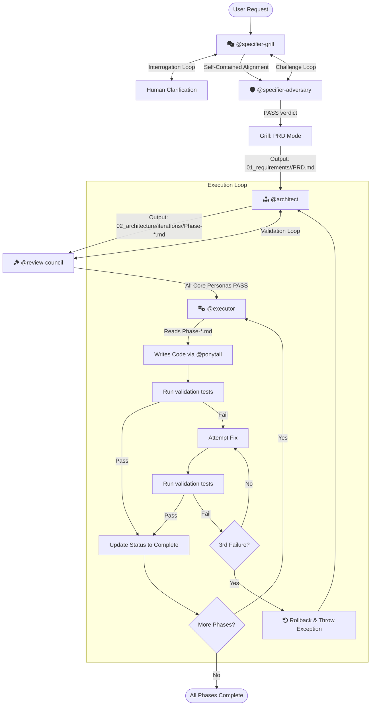

# Agentic Workflow for Antigravity & Gemini

A structured, token-optimized software development workflow for Antigravity and Gemini.

## Quick Start

1. Run `@setup-core-workflow` (or `/setup-core-workflow`) to configure the workflow for your repository.
2. Start with `@specifier-grill` — it captures your scope through conversation, no pre-written scope file needed.
3. Use `@orchestrator` for the build ceremony once you have an approved PRD.

## Available Skills

### Core Workflow (4-Stage SDLC)

| Skill | Purpose |
|-------|---------|
| `@specifier-grill` | Adversarial grilling, alignment, and PRD generation — captures scope through conversation |
| `@specifier-adversary` | Counter-grilling of alignment summary to break bias before PRD generation |
| `@architect` | Translate PRDs into vertical-sliced technical blueprints (`Phase-*.md`) |
| `@review-council` | Multi-persona validation (Security & Resilience, Data Integrity, Pragmatism & Scope, Testability) |
| `@executor` | Phase-by-phase implementation with escape hatch |
| `@orchestrator` | Build-loop automation (`@architect` → `@review-council` → `@executor`) |
| `@prototype` | Throwaway exploration code — no ceremony |

### Ponytail (Lazy Senior Dev Mode)

| Skill | Purpose |
|-------|---------|
| `@ponytail` | Forces simplest solution: YAGNI, stdlib first, minimal code |
| `@ponytail-review` | Over-engineering focused code review |
| `@ponytail-audit` | Whole-repo audit for complexity |
| `@ponytail-debt` | Track deliberate simplifications |
| `@ponytail-help` | Quick reference card |

### Setup

| Skill | Purpose |
|-------|---------|
| `@setup-core-workflow` | Initialize workflow directories and configuration |

## Workflow Directory Structure

After running `@setup-core-workflow`:

```text
AgentWorkflow/
├── 01_requirements/
│   └── <phase>/
│       ├── alignment.md    # Self-contained grilling output (scope, glossary, decisions)
│       ├── challenge.md    # Adversary challenge log
│       └── PRD.md          # Immutable requirements contract
├── 02_architecture/
│   └── iterations/<iter>/Phase-*.md
├── 03_reviews/
│   └── <phase>/<iter>/<phase>-review.md
└── 04_execution/
    └── PROGRESS.md
```

## The 4-Stage Pipeline



## Deployment

To deploy all skills globally to your Antigravity configuration (`~/.gemini/config/skills/`):

```bash
./scripts/deploy-skills.sh
```
