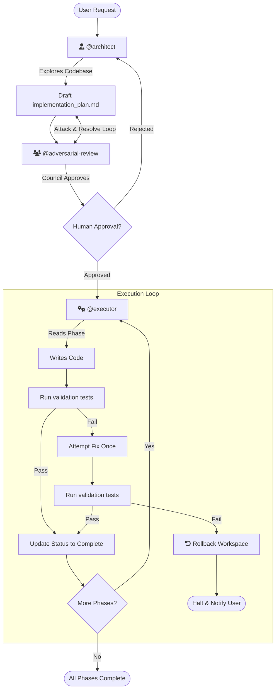

# Core Workflow Plugin

This plugin provides the foundational rule set and automation skills for deterministic, phase-by-phase feature implementation in Antigravity. It forces the agent into specialized personas to ensure code is thoughtfully designed, rigorously reviewed, and strictly executed.

## The Workflow

The core workflow relies on three distinct agent personas operating in a strict sequence:



1. **The Architect (`@architect`)**: Researches the existing codebase and writes a strict, phased `implementation_plan.md` that dictates exactly how the feature will be built.
2. **The Adversarial Council (`@adversarial-review`)**: A suite of 8 distinct personas (e.g. Chaos Engineer, Security Auditor, Pragmatist) that ruthlessly critique and attack the Architect's plan before any code is written.
3. **The Executor (`@executor`)**: Reads the approved plan and implements it phase-by-phase. It relies on the custom automation scripts in the `skills` directory to strictly enforce validation gates and workspace rollbacks on failure.

---

## Setup Instructions for Other Projects

To make these skills reproducible in other repositories, ensure the following dependencies are installed in your project's virtual environment.

### Core Workflow Skills

The Python scripts in the `skills` directory are designed to be generic and portable. They respect the following environment variables:
- `PROJECT_ROOT`: The root directory of the project (defaults to the current working directory).
- `LAUNCH_CMD`: A custom command to launch the app (if not provided, `launch_app.py` will try to auto-detect based on `docker-compose.yml`, `manage.py`, or `package.json`).

To quickly configure your terminal environment when testing or using these skills manually, source the provided helper script:
```bash
source setup_env.sh
```

### FastContext Integration

The `fastcontext` skill requires the FastContext CLI to be available in the environment where the agent runs commands.

1. Ensure your project uses a virtual environment (e.g., `.venv`) and that it is activated.
2. Install FastContext directly from its GitHub repository:
   ```bash
   pip install git+https://github.com/microsoft/fastcontext.git
   ```
3. Copy the `.agents` folder (or the relevant `plugin.json` configuration and `skills/fastcontext.md`) to the new repository.

This guarantees that the `Bash(fastcontext *)` tool calls made by the agent will succeed.
