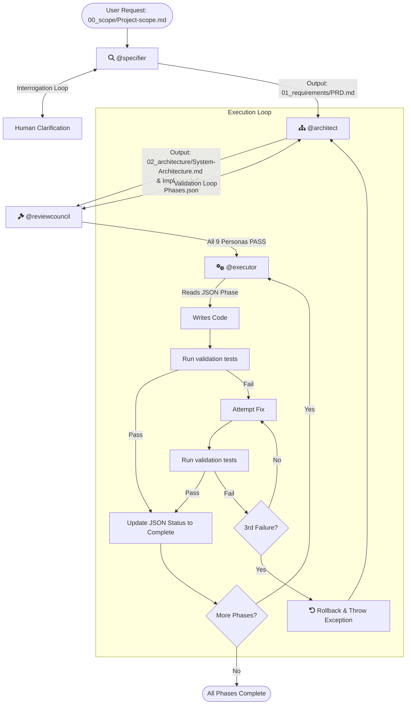

# Core Workflow Plugin

This plugin provides the foundational rule set and automation skills for deterministic, phase-by-phase feature implementation in Antigravity. It enforces a rigid, contract-driven **4-Stage Grounded Software Development Lifecycle (SDLC)**.

## The 4-Stage SDLC Workflow

The core workflow relies on four distinct agent personas operating in a strict sequence:



### Stage 1: The Specifier (`@specifier`)
- **Role:** The Interrogator and Clarifier.
- **Input:** `AgentWorkflow/00_scope/Project-scope.md`
- **Behavior:** Refuses to generate a plan until all "Ambiguity Chasms" are resolved by the human.
- **Output:** The immutable `AgentWorkflow/01_requirements/PRD.md`.

### Stage 2: The Architect (`@architect`)
- **Role:** The Translator.
- **Input:** `PRD.md` (from Stage 1) or `ArchitecturalException` (from Stage 4).
- **Behavior:** Translates the rigid PRD contract into technical blueprints. Generates technical diagrams and atomic execution steps.
- **Output:** `AgentWorkflow/02_architecture/System-Architecture.md` and `Implementation-Phases.json`.

### Stage 3: The Review Council (`@reviewcouncil`)
- **Role:** The Enforcers (9 Specialized Personas).
- **Input:** `PRD.md` and `Implementation-Phases.json`.
- **Behavior:** Strictly evaluates the architecture against constraints established in the `PRD.md`. It outputs `PASS` or `REJECT` (with citation). The system iterates with the Architect until a unanimous `PASS` is achieved.
- **Output:** `AgentWorkflow/03_reviews/review_log.md`.

### Stage 4: The Executor (`@executor`)
- **Role:** The Builder.
- **Input:** Approved `Implementation-Phases.json`.
- **Behavior:** Implements the plan phase-by-phase using Python automation skills. Features the **Upstream Escape Hatch**: a maximum of 2 attempts to fix tests autonomously. Upon the 3rd failure, it halts code generation, rolls back, and throws an `ArchitecturalException` upstream to the Architect.
- **Output:** Working code, tests, and `AgentWorkflow/04_execution/PROGRESS.md`.

---

## Artifact Directory Structure

The workflow enforces a strict project structure to track progress seamlessly.

```text
AgentWorkflow/
├── 00_scope/                  
│   └── Project-scope.md
├── 01_requirements/           
│   └── PRD.md                 
├── 02_architecture/           
│   ├── System-Architecture.md 
│   └── Implementation-Phases.json 
├── 03_reviews/                
│   └── review_log.md          
└── 04_execution/              
    └── PROGRESS.md            
```

---

## Setup Instructions for Other Projects

To make these skills reproducible in other repositories, ensure the following dependencies are installed in your project's virtual environment.

### Core Workflow Skills

The Python scripts in the `skills` directory strictly parse `Implementation-Phases.json` to handle validation gates, workspace rollbacks, and progress tracking. They respect the following environment variables:
- `PROJECT_ROOT`: The root directory of the project (defaults to the current working directory).
- `LAUNCH_CMD`: A custom command to launch the app (if not provided, `launch_app.py` will try to auto-detect based on `docker-compose.yml`, `manage.py`, or `package.json`).

To quickly configure your terminal environment when testing or using these skills manually, source the provided helper script:
```bash
source setup_env.sh
```
